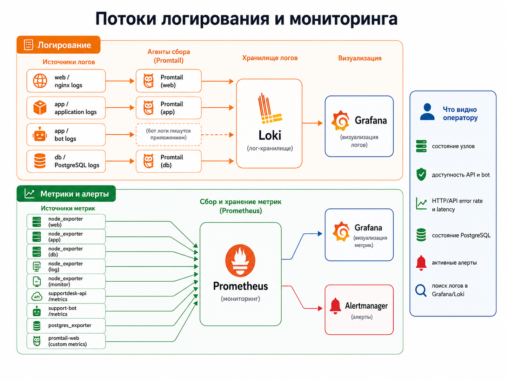
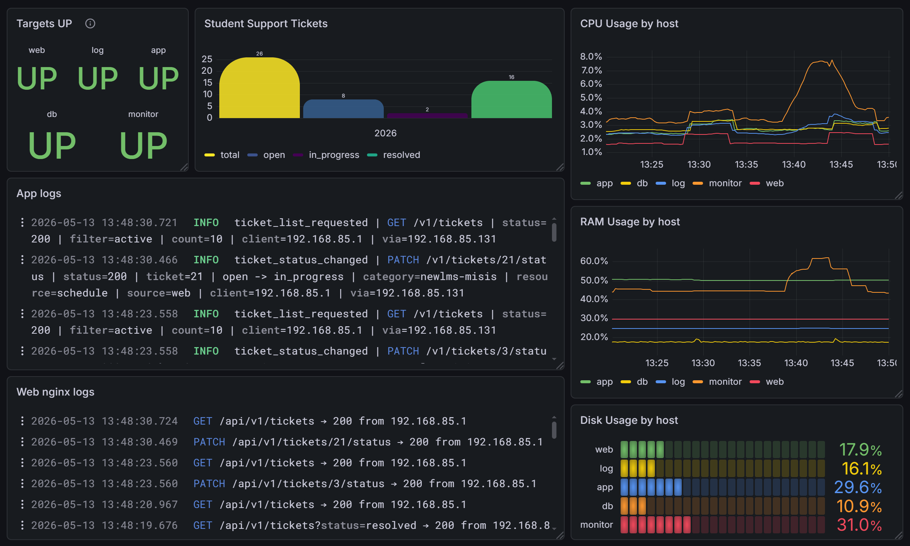
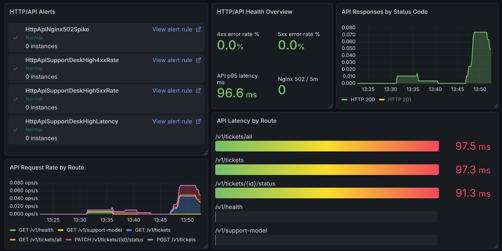
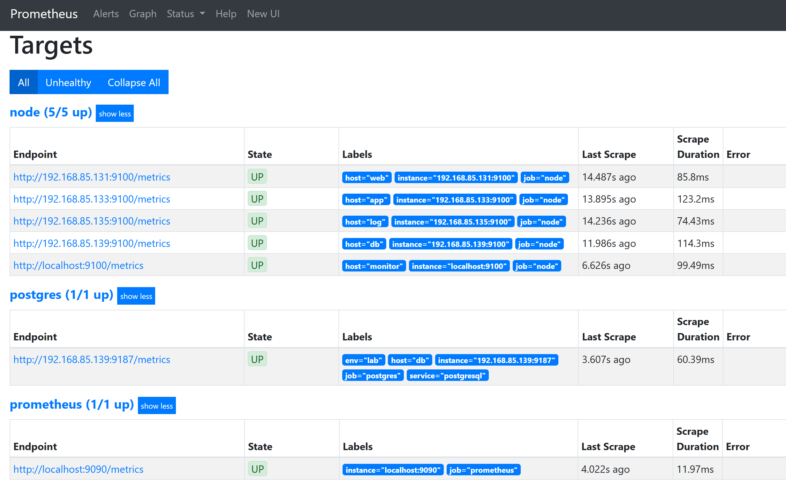
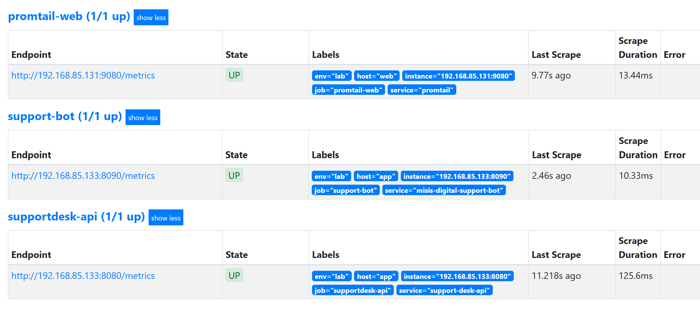
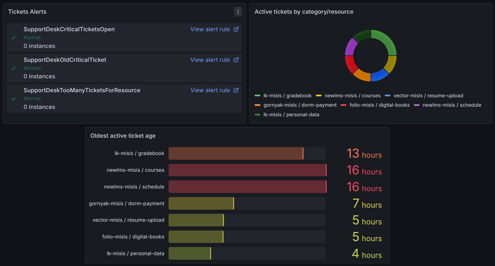
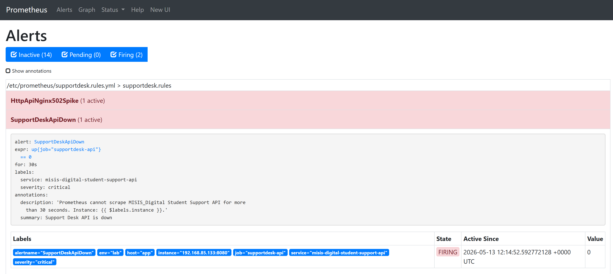

# Mini Corporate Infrastructure Stand

Mini Corporate Infrastructure Stand — инфраструктурный стенд для отработки полного цикла администрирования и сопровождения небольшой корпоративной системы: от публикации приложения через reverse proxy до централизованного логирования, мониторинга, алертинга, резервного копирования и автоматизации операций через Ansible.

Стенд построен на отдельных Debian VM с разделением ролей: управляющий узел, frontend/reverse proxy, application runtime, база данных, централизованное хранилище логов и сервер мониторинга. Такой формат делает инфраструктуру наглядной: можно отдельно проверять пользовательский HTTP-путь, работу backend API, состояние PostgreSQL, доставку логов, scrape target-ы Prometheus, правила алертинга, backup/restore и Ansible-сценарии. Отдельно в архитектуре выделен Telegram-клиент: `support-bot` работает как отдельный сервис и обращается к `supportdesk-api`, не записывая данные в PostgreSQL напрямую.

В качестве рабочей нагрузки используется приложение `MISIS_Digital Student Support`. Это небольшой сервис заявок по цифровым сервисам университета. Его задача в проекте — не заменить полноценную helpdesk-систему, а дать стенду реалистичный поток событий: HTTP-запросы, структурированные app logs, прикладные метрики, записи в PostgreSQL, события для алертов и сценарии диагностики.

## Что реализовано

В текущей версии стенд покрывает несколько инфраструктурных направлений.

| Направление | Реализация |
|---|---|
| Публикация приложения | `web` принимает HTTP-запросы через Nginx и проксирует `/api/*` на backend API |
| Runtime приложения | `app` запускает backend API и Telegram-клиент через Docker Compose |
| Хранение состояния | `db` хранит заявки и историю событий в PostgreSQL |
| Логирование | Promtail собирает nginx, app, bot и PostgreSQL logs и отправляет их в Loki |
| Метрики | Prometheus собирает node, API, bot, PostgreSQL и nginx-derived metrics |
| Визуализация | Grafana dashboard `Infrastructure Overview` объединяет инфраструктурные, прикладные, HTTP/API, DB и bot-панели |
| Алертинг | Prometheus rules и Alertmanager отслеживают API, HTTP/API, PostgreSQL, bot и node-состояния |
| Backup/restore | PostgreSQL backup выполняется через `pg_dump -Fc`, checksum, `latest.dump`, retention и restore test |
| Автоматизация | `admin` используется как Ansible control node с inventory, group_vars, roles и playbook-ами |
| Контроль доступа | Сетевые потоки ограничены allowlist-правилами; Docker published ports на `app` защищены через `DOCKER-USER` |

## Архитектура


_Общая архитектура: узлы web/app/db/log/monitor/admin, прикладной трафик, логирование, метрики и управление._

Основные прикладные потоки:

```text
Browser -> web/Nginx -> supportdesk-api -> db/PostgreSQL
Telegram user -> support-bot -> supportdesk-api -> db/PostgreSQL
```

Во втором потоке `support-bot` работает как отдельный Docker Compose service на `app`, но не пишет в PostgreSQL напрямую. Он использует тот же backend API, что и web-интерфейс, поэтому бизнес-логика и audit trail остаются в одном месте.


_Два клиента используют один backend API: web-поток и Telegram-поток сходятся в supportdesk-api и PostgreSQL._

Поток логирования:

```text
web/app/bot/db logs -> Promtail -> Loki -> Grafana
```

Поток метрик и алертов:

```text
exporters/API metrics -> Prometheus -> Grafana / Alertmanager
```

Поток управления:

```text
admin -> Ansible -> web/app/db/log/monitor
```


_Сетевая модель: пользовательский вход через web, management через admin, metrics scrape через monitor, доступ к DB без прямого пользовательского входа._

## Состав стенда

| Узел | IP | Роль |
|---|---:|---|
| `admin` | `192.168.85.129` | управляющий узел: SSH, Ansible, Git, inventory, playbook-и |
| `web` | `192.168.85.131` | Nginx frontend, reverse proxy, nginx logs, Promtail, node_exporter |
| `app` | `192.168.85.133` | Docker Compose runtime: backend API и Telegram-клиент |
| `db` | `192.168.85.139` | PostgreSQL 17, schema `tickets`/`ticket_events`, backups, postgres_exporter |
| `log` | `192.168.85.135` | Loki как централизованное хранилище логов |
| `monitor` | `192.168.85.137` | Prometheus, Grafana, Alertmanager |

## Технологический стек

| Слой | Инструменты |
|---|---|
| Виртуализация | Proxmox VE, Debian VM |
| Web / proxy | Nginx |
| Application runtime | Python, Docker, Docker Compose |
| Database | PostgreSQL 17 |
| Logging | Promtail, Loki, LogQL |
| Metrics | Prometheus, node_exporter, postgres_exporter, custom API metrics |
| Dashboards | Grafana |
| Alerting | Prometheus rules, Alertmanager |
| Automation | Ansible, Git |
| Backup | `pg_dump -Fc`, systemd service/timer, sha256 checksum |
| Network control | UFW, iptables `DOCKER-USER`, access matrix |

## Рабочая нагрузка

`MISIS_Digital Student Support` моделирует сервис поддержки по цифровым сервисам университета. Пользователь выбирает цифровой сервис, раздел внутри него, приоритет и описание проблемы. Backend валидирует пару `category/resource`, сохраняет заявку в PostgreSQL и пишет событие в `ticket_events`.

Примеры категорий:

```text
newlms-misis, lk-misis, gornyak-misis, folio-misis, pulse-misis, vector-misis, pay-misis
```

Примеры событий в логах:

```text
ticket_created
ticket_status_changed
ticket_status_unchanged
ticket_validation_failed
support_model_requested
```

Эта нагрузка используется для проверки не только доступности сервисов, но и связок “пользовательское действие -> HTTP-запрос -> запись в БД -> app log -> метрика -> dashboard/alert” и “Telegram-действие -> support-bot -> backend API -> PostgreSQL -> bot/app logs -> metrics”.

## Наблюдаемость



_Observability-слой: Promtail/Loki для логов, Prometheus/Grafana/Alertmanager для метрик и алертов._

В Grafana собран dashboard `Infrastructure Overview`. Он включает:

- состояние node target-ов;
- CPU/RAM/Disk по узлам;
- состояние `supportdesk-api`;
- количество заявок и разрезы по category/resource/priority;
- HTTP/API request rate, status codes и p95 latency;
- состояние PostgreSQL и использование подключений;
- runtime и API-зависимости Telegram-клиента;
- nginx/app/bot/PostgreSQL logs;
- активные алерты по tickets, HTTP/API, DB и bot.



_Нормальное состояние инфраструктурного dashboard: target-ы UP, tickets, app/nginx logs, CPU/RAM/Disk._



_HTTP/API-блок dashboard: request rate, status codes и p95 latency._

Prometheus собирает метрики с jobs:

```text
node
supportdesk-api
support-bot
promtail-web
postgres
prometheus
```



_Основные scrape target-ы Prometheus: node, postgres и self-scrape в состоянии UP._



_Дополнительные jobs: supportdesk-api, support-bot и promtail-web в состоянии UP._

## Автоматизация

`admin` используется как управляющий узел. В `infra/ansible/control-node/` лежит актуальная структура Ansible-проекта: inventory, group_vars, playbook-и, roles и файлы, которые раскатываются на узлы.

Ключевые сценарии:

```text
playbooks/check.yml                    общая проверка состояния стенда
playbooks/deploy_app.yml               деплой backend API
playbooks/deploy_bot.yml               деплой Telegram-клиента
playbooks/deploy_nginx_frontend.yml    деплой Nginx/frontend
playbooks/deploy_promtail.yml          деплой Promtail-конфигов
playbooks/deploy_prometheus.yml        деплой Prometheus config/rules
playbooks/run_db_backup.yml            ручной запуск и проверка backup
playbooks/network_audit.yml            аудит сетевого состояния
```


_Итог `ansible-playbook playbooks/check.yml`: все узлы проверены, `failed=0`, `unreachable=0`._

## Резервное копирование

Для PostgreSQL настроен logical backup:

```text
pg_dump -Fc -> .dump
sha256sum -> .sha256
latest.dump -> ссылка на последний backup
retention -> 7 дней
systemd timer -> daily запуск
restore test -> проверка восстановления в отдельную БД
```

Снимки VM могут использоваться как rollback-точки перед инфраструктурными изменениями. Данные приложения защищаются отдельно через PostgreSQL backup/restore.


_Backup timer, каталог dump-файлов, `latest.dump`, восстановленная тестовая БД и count по таблице tickets._

## Структура репозитория

```text
README.md
SPECIFICATION.md

docs/
  architecture.md
  runtime-and-deployment.md
  network-and-security.md
  observability.md
  automation.md
  database-and-backups.md
  demo-guide.md
  troubleshooting.md
  limitations-and-roadmap.md
  visual-assets-map.md

infra/
  ansible/
  nginx/
  docker/
  prometheus/
  promtail/
  postgres/
  firewall/
  grafana/

src/
  app.py
  bot.py
  frontend/index.html

examples/
  env/
  promql.md
  logql.md

assets/
  diagrams/
  screenshots/
```

## Документация

| Файл | Содержание |
|---|---|
| `SPECIFICATION.md` | технический контракт текущего состояния стенда |
| `docs/architecture.md` | архитектура, роли узлов и основные потоки |
| `docs/runtime-and-deployment.md` | runtime приложения, Docker Compose и deployment flow |
| `docs/network-and-security.md` | IP-план, access matrix, firewall и Docker published ports |
| `docs/observability.md` | logging, metrics, dashboard и alerts |
| `docs/automation.md` | Ansible control node, roles и playbook-и |
| `docs/database-and-backups.md` | PostgreSQL, schema, backup и restore |
| `docs/demo-guide.md` | сценарии демонстрации стенда |
| `docs/troubleshooting.md` | диагностика типовых проблем |
| `docs/limitations-and-roadmap.md` | ограничения текущей версии и развитие |
| `docs/visual-assets-map.md` | карта вставленных схем и скриншотов |

## Демонстрационные сценарии

Демонстрация стенда построена не вокруг одного happy path, а вокруг проверки разных инженерных слоев. Важно показать не только то, что приложение открывается, но и то, как инфраструктура помогает локализовать проблему: где находится сбой, какой сигнал появляется в логах, какая метрика меняется, какой alert срабатывает и как проверить восстановление.

Рекомендуемый порядок показа:

| Сценарий | Что показывает |
|---|---|
| End-to-end заявка | путь `Browser -> web/Nginx -> supportdesk-api -> PostgreSQL`, запись в `tickets` и событие в `ticket_events` |
| Web и Telegram как два клиента | `support-bot` использует тот же backend API, что и web-интерфейс; прямой записи в PostgreSQL из bot нет |
| Product incident | несколько active-заявок на одном `category/resource` приводят к росту product metrics и alert-у `SupportDeskTooManyTicketsForResource` |
| Proxy/API failure | отличие между недоступностью backend scrape target-а и пользовательскими `502` на reverse proxy path |
| DB degradation | backend-контейнер может оставаться запущенным, но операции с заявками ломаются из-за PostgreSQL; это другой класс инцидента |
| Observability degradation | сервис может работать, но часть логов или метрик перестает поступать; проблема видна через Prometheus targets, Loki streams и Promtail/node exporter checks |
| Backup/restore drill | проверка `pg_dump -Fc`, checksum, `latest.dump`, retention и восстановления в тестовую БД |
| Ansible operational check | проверка состояния стенда с `admin` через `check.yml` и аудит сетевого слоя через `network_audit.yml` |

Подробные шаги, команды, ожидаемые сигналы и восстановление описаны в `docs/demo-guide.md`. Диагностические разборы по симптомам вынесены в `docs/troubleshooting.md`.


_Web UI с активными и resolved-заявками._



_Product observability по заявкам: active tickets, category/resource и возраст active ticket._



_Controlled failure: Prometheus Alerts показывает активные сигналы по backend/proxy._


_Финальная операционная проверка с control node._

## Ограничения текущей версии

Стенд не позиционируется как отказоустойчивый production-кластер. В текущую область не входят публичная публикация сервиса в интернет, Kubernetes, полноценный CI/CD pipeline, внешний secrets manager и удаленное backup-хранилище. Эти направления вынесены в `docs/limitations-and-roadmap.md`.

Секреты не входят в репозиторий. В пакете есть только шаблоны переменных окружения в `examples/env/`.
