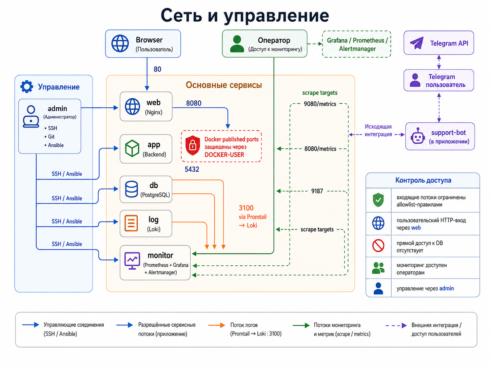

# Техническая спецификация

## 1. Назначение

Mini Corporate Infrastructure Stand предназначен для отработки полного цикла сопровождения небольшой внутренней системы: публикация приложения через reverse proxy, запуск runtime-сервисов, хранение состояния в PostgreSQL, централизованное логирование, сбор метрик, визуализация, алертинг, backup/restore и автоматизация операционных действий.

Стенд использует приложение `MISIS_Digital Student Support` как рабочую нагрузку. Приложение создает HTTP-трафик, структурированные логи, прикладные метрики, записи в PostgreSQL и события для диагностики.

## 2. Область действия

В текущую версию входят:

- отдельные узлы для web, app, db, log, monitor и admin;
- Nginx frontend и reverse proxy;
- backend API и Telegram-клиент в Docker Compose;
- PostgreSQL-хранилище заявок и событий;
- Promtail/Loki для централизованного логирования;
- Prometheus/Grafana/Alertmanager для метрик, dashboard-ов и алертов;
- node_exporter и postgres_exporter;
- PostgreSQL backup через `pg_dump -Fc`;
- Ansible control node с inventory, group_vars, roles и playbook-ами;
- сетевой allowlist и защита Docker published ports через `DOCKER-USER`.

В текущую версию не входят:

- публичная публикация сервиса в интернет;
- отказоустойчивый кластер;
- Kubernetes;
- внешний secrets manager;
- полноценный CI/CD pipeline;
- удаленное backup-хранилище.


_Визуальное представление узлов, сервисов и основных потоков текущей версии стенда._

## 3. Узлы стенда

| Узел | IP | Назначение |
|---|---:|---|
| `admin` | `192.168.85.129` | управляющий узел: SSH, Ansible, Git, inventory, playbook-и |
| `web` | `192.168.85.131` | HTTP-вход, Nginx frontend, reverse proxy, nginx logs |
| `app` | `192.168.85.133` | Docker Compose runtime backend API и Telegram-клиента |
| `db` | `192.168.85.139` | PostgreSQL, backup automation, postgres_exporter |
| `log` | `192.168.85.135` | Loki log storage |
| `monitor` | `192.168.85.137` | Prometheus, Grafana, Alertmanager |

## 4. Сервисы и порты

| Сервис | Узел | Порт | Назначение |
|---|---|---:|---|
| Nginx | `web` | 80 | frontend и reverse proxy `/api/*` |
| supportdesk-api | `app` | 8080 | backend API и `/metrics` |
| support-bot metrics | `app` | 8090 | метрики Telegram-клиента |
| PostgreSQL | `db` | 5432 | состояние заявок и события |
| Loki | `log` | 3100 | прием и выдача логов |
| Prometheus | `monitor` | 9090 | сбор метрик и evaluation rules |
| Grafana | `monitor` | 3000 | dashboard-ы и Explore |
| Alertmanager | `monitor` | 9093 | прием alerts от Prometheus |
| node_exporter | all managed nodes | 9100 | системные метрики |
| postgres_exporter | `db` | 9187 | PostgreSQL metrics |
| Promtail metrics | `web/app/db` | 9080 | служебные метрики Promtail |

Полная матрица доступов находится в `infra/firewall/access-matrix.md`.

## 5. Контракт приложения

Backend API должен:

- слушать `0.0.0.0:8080` внутри контейнера;
- отдавать `GET /v1/health`;
- отдавать `GET /v1/support-model`;
- поддерживать `GET /v1/tickets`, `GET /v1/tickets/all`, `GET /v1/tickets?status=resolved`;
- поддерживать `POST /v1/tickets`;
- поддерживать `PATCH /v1/tickets/<id>/status`;
- отдавать Prometheus metrics на `/metrics`;
- хранить состояние в PostgreSQL;
- писать structured logs в `/var/log/app/app.log`.

Файл `tickets.json` не является runtime-хранилищем текущей версии.

## 6. Контракт данных

PostgreSQL database: `supportdesk`.

Основные таблицы:

| Таблица | Назначение |
|---|---|
| `tickets` | текущее состояние заявок |
| `ticket_events` | история событий и audit trail |

Схема хранится в `infra/postgres/schema.sql`.

## 7. Контракт логирования

Логи должны поступать в Loki через Promtail.

| Источник | Файл | Loki labels |
|---|---|---|
| Nginx | `/var/log/nginx/*.log` | `host=web`, `job=nginx`, `service=frontend` |
| backend API | `/var/log/app/*.log` | `host=app`, `job=app`, `service=misis-digital-student-support-api` |
| Telegram-клиент | `/var/log/bot/*.log` | `host=app`, `job=support-bot`, `service=misis-digital-support-bot` |
| PostgreSQL | `/var/log/postgresql/*.log` | `host=db`, `job=postgresql`, `service=postgresql` |

App logs используют формат `key=value`. Для app logs Promtail извлекает `category` как Loki label.

## 8. Контракт метрик

Prometheus должен собирать следующие группы target-ов:

| Job | Источник |
|---|---|
| `node` | node_exporter на `web/app/db/log/monitor` |
| `supportdesk-api` | backend API `/metrics` |
| `support-bot` | Telegram-клиент `/metrics` |
| `promtail-web` | Promtail metrics на `web` |
| `postgres` | postgres_exporter на `db` |
| `prometheus` | self-scrape |

Ключевые группы метрик:

- system metrics: CPU, RAM, disk, target availability;
- product metrics: tickets total/current/active/age;
- HTTP/API metrics: request counter, status code, latency histogram;
- bot metrics: actions, API requests, latency, errors;
- PostgreSQL metrics: `pg_up`, connections, DB size, commits/rollbacks;
- nginx-derived metrics: response status codes из Promtail pipeline.

## 9. Контракт алертинга

Alert rules хранятся в `infra/prometheus/supportdesk.rules.yml`.

| Alert | Слой | Severity | Назначение |
|---|---|---|---|
| `SupportDeskApiDown` | application | critical | backend API недоступен для Prometheus |
| `HttpApiSupportDeskHigh4xxRate` | HTTP/API | warning | высокая доля 4xx |
| `HttpApiSupportDeskHigh5xxRate` | HTTP/API | critical | высокая доля 5xx |
| `HttpApiSupportDeskHighLatency` | HTTP/API | warning | высокая p95 latency |
| `HttpApiNginx502Spike` | proxy | critical | Nginx возвращает 502 |
| `PostgreSQLExporterDown` | database | critical | postgres_exporter недоступен |
| `PostgreSQLDown` | database | critical | PostgreSQL недоступен для exporter-а |
| `PostgreSQLTooManyConnections` | database | warning | высокая доля занятых подключений |
| `HighDiskUsage` | infrastructure | warning | высокий usage root filesystem |
| `NodeTargetDown` | infrastructure | critical | node_exporter target недоступен |
| `SupportDeskTooManyTicketsForResource` | product | warning | концентрация active-заявок на category/resource |
| `SupportDeskCriticalTicketsOpen` | product | critical | есть active critical-заявка |
| `SupportDeskOldCriticalTicket` | product | critical | active critical-заявка открыта слишком долго |
| `SupportBotDown` | bot | critical | Telegram-клиент metrics target недоступен |
| `SupportBotBackendErrors` | bot/API | warning | Telegram-клиент получает ошибки от backend API |
| `SupportBotErrorsDetected` | bot | warning | ошибки обработки внутри Telegram-клиента |

## 10. Контракт backup/restore

PostgreSQL backup должен выполняться через:

- `pg_dump -Fc`;
- checksum `.sha256`;
- symlink `latest.dump`;
- retention 7 дней;
- `backup-supportdesk.service`;
- `backup-supportdesk.timer`;
- restore test в отдельную БД.

Backup-скрипт и systemd units находятся в `infra/postgres/`.

## 11. Контракт автоматизации

Ansible-проект находится в `infra/ansible/control-node/`.

Обязательные элементы:

- `ansible.cfg`;
- `inventory/hosts.ini`;
- `inventory/group_vars/`;
- `roles/`;
- `playbooks/`;
- `files/`.

Ключевая проверка состояния стенда:

```bash
ansible-playbook playbooks/check.yml
```

Network audit выполняется отдельно:

```bash
ansible-playbook playbooks/network_audit.yml
```

## 12. Сетевая модель

Основной внешний HTTP-вход стенда — `web:80`. Прямой пользовательский доступ к `app`, `db`, `log` не является основным entrypoint-ом.

Критические внутренние потоки:

```text
web -> app:8080
support-bot -> supportdesk-api:8080 внутри Docker Compose network
app -> db:5432
web/app/db -> log:3100
monitor -> exporters and metrics endpoints
admin -> SSH/Ansible -> managed nodes
```

На `app` Docker-published ports `8080` и `8090` ограничиваются через `DOCKER-USER`, так как Docker может обходить обычную модель UFW для опубликованных портов.



_Сетевая модель и контроль доступа: entrypoints, management, observability и Telegram outbound integration._

## 13. Secrets policy

Секреты не хранятся в пакете документации и конфигураций.

Исключены:

- реальные `.env` и `.env.bot`;
- пароли PostgreSQL;
- Telegram token;
- SSH private keys;
- backup dumps.

В пакете есть только шаблоны: `examples/env/app.env.example` и `examples/env/bot.env.example`.
