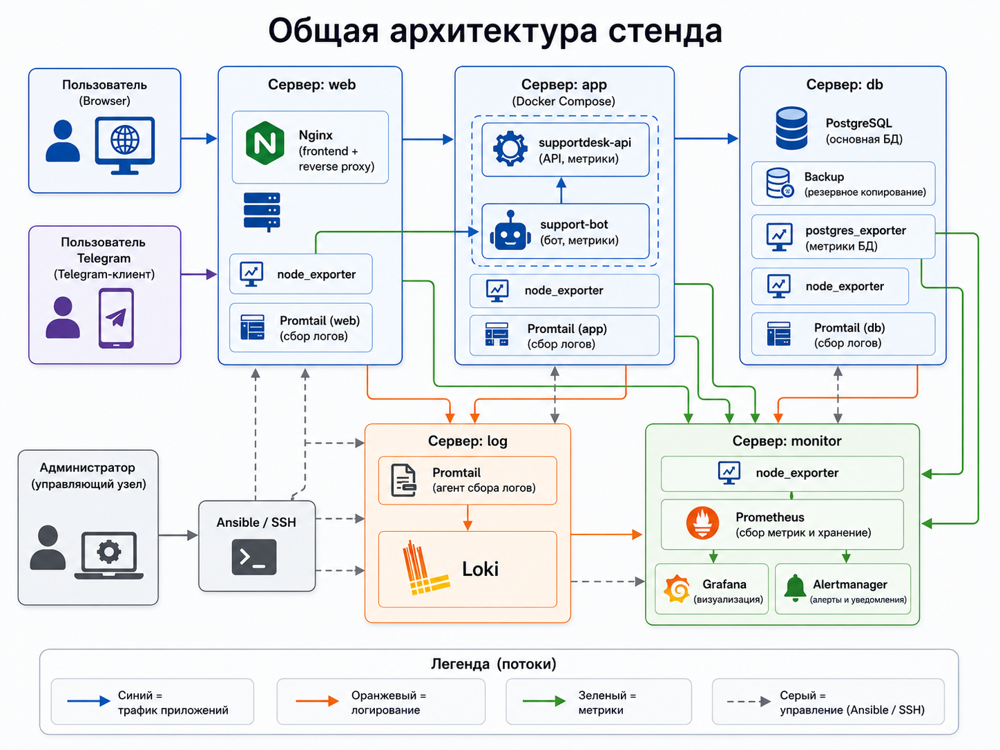
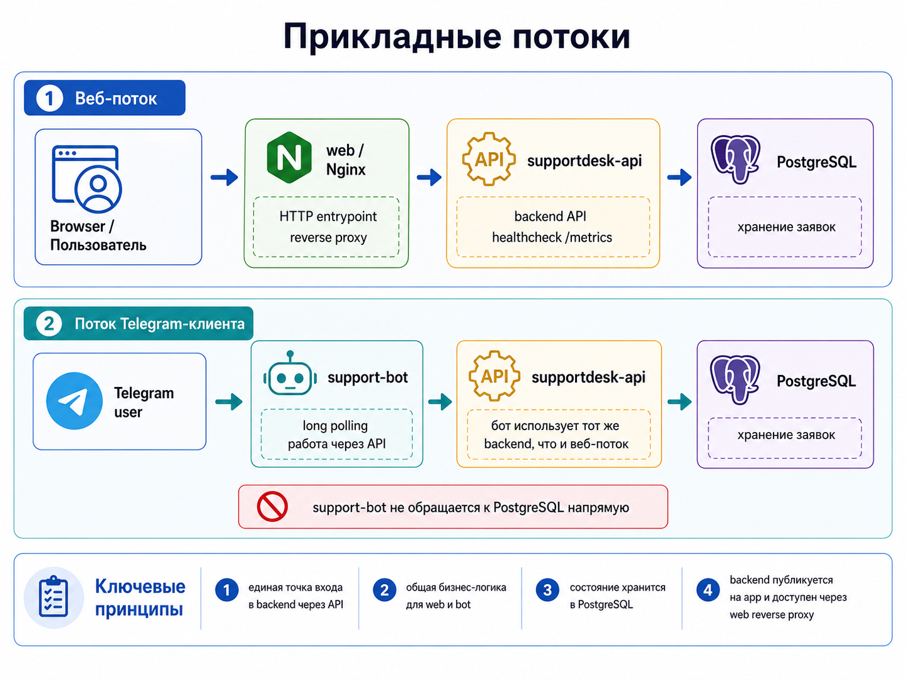

# Архитектура стенда

## Общая схема



_Полная схема стенда: пользователи, управляющий узел, web/app/db/log/monitor, app traffic, logging, metrics и Ansible/SSH._

Стенд развернут на базе Proxmox VE. Инфраструктурные роли вынесены на отдельные Debian VM, чтобы границы ответственности и сетевые потоки были явно разделены.

## Роли узлов

| Узел | Роль |
|---|---|
| `admin` | управляющий узел: SSH, Ansible, Git, inventory, playbook-и |
| `web` | HTTP-вход, Nginx frontend, reverse proxy, nginx logs |
| `app` | backend API и Telegram-клиент в Docker Compose |
| `db` | PostgreSQL, backup automation, postgres_exporter |
| `log` | Loki как централизованное хранилище логов |
| `monitor` | Prometheus, Grafana, Alertmanager |

## Основные потоки



_Web-клиент и Telegram-клиент работают через один backend API; прямой записи из support-bot в PostgreSQL нет._


### Пользовательский HTTP-поток

```text
Browser -> web/Nginx -> supportdesk-api -> db/PostgreSQL
```

`web` является основной HTTP-точкой входа. Nginx отдает frontend и проксирует `/api/*` на backend API.

### Поток Telegram-клиента

```text
Telegram user -> support-bot -> supportdesk-api -> db/PostgreSQL
```

`support-bot` работает как отдельный Docker Compose service на узле `app`. Он не обращается к PostgreSQL напрямую: все операции с заявками проходят через backend API.

### Поток приложения к базе данных

```text
supportdesk-api -> db/PostgreSQL
```

Backend API хранит состояние заявок в таблице `tickets`, а историю изменений — в `ticket_events`.

### Поток логов

```text
web/app/bot/db logs -> Promtail -> Loki -> Grafana
```

Логи Nginx, backend API, Telegram-клиента и PostgreSQL остаются на узлах в стандартных файлах и передаются в Loki через Promtail.

### Поток метрик

```text
Prometheus -> node_exporter / app metrics / bot metrics / postgres_exporter / promtail-web
```

Prometheus собирает как системные, так и прикладные метрики.

### Поток алертов

```text
Prometheus rules -> Alertmanager -> operator
```

Alertmanager принимает состояния от Prometheus. Dashboard также показывает активные группы alerts.

### Поток автоматизации

```text
admin -> Ansible -> managed nodes
```

`admin` хранит inventory, group_vars, роли, playbook-и и файлы конфигураций.

## Архитектурные решения

- frontend и backend разделены: `web` не хранит состояние приложения;
- база данных вынесена на отдельный узел `db`;
- runtime приложения контейнеризирован через Docker Compose;
- логирование централизовано через Loki;
- метрики собираются pull-моделью через Prometheus;
- контроль состояния выполняется из `admin` через Ansible;
- сетевые потоки описаны явно и ограничиваются allowlist-подходом.
