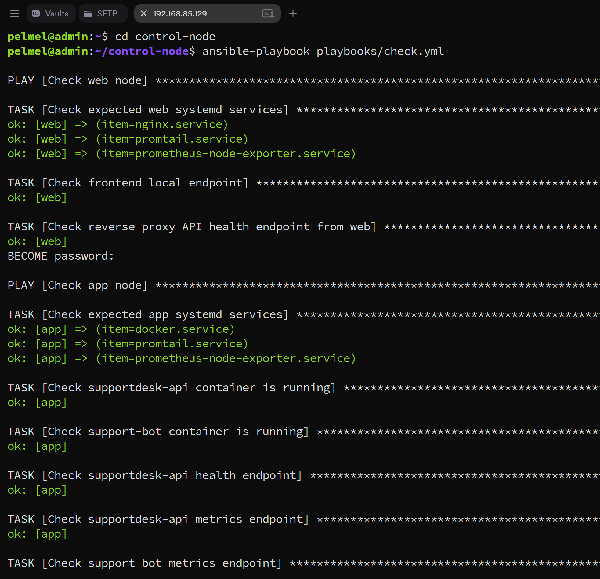
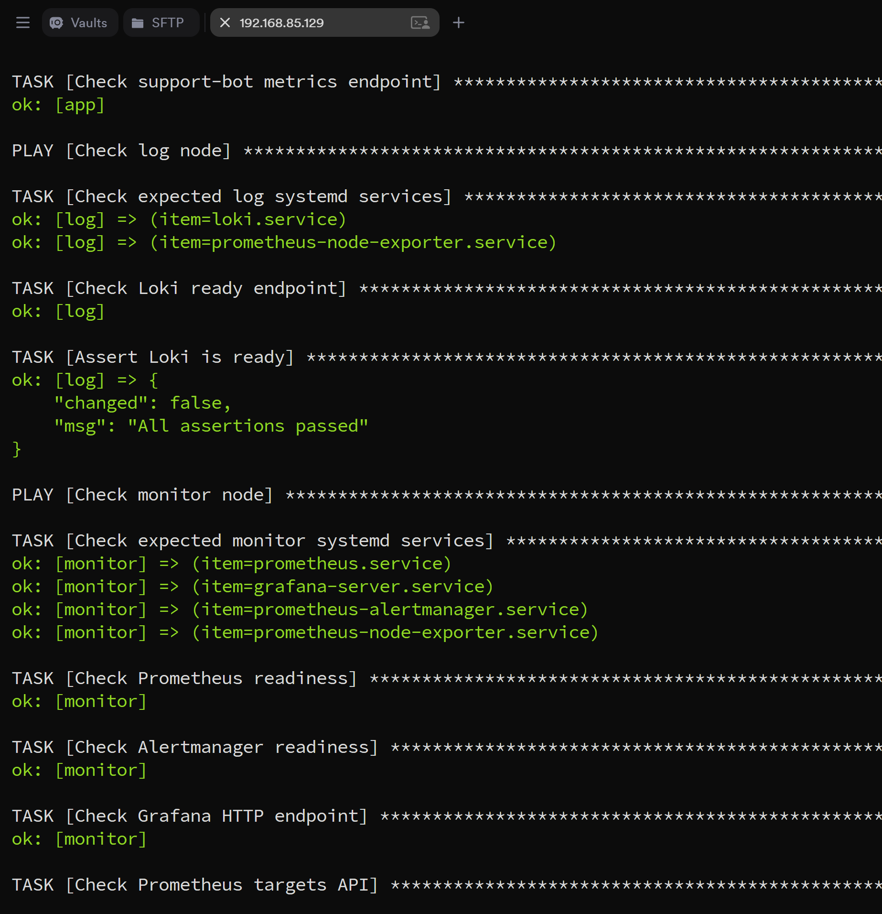
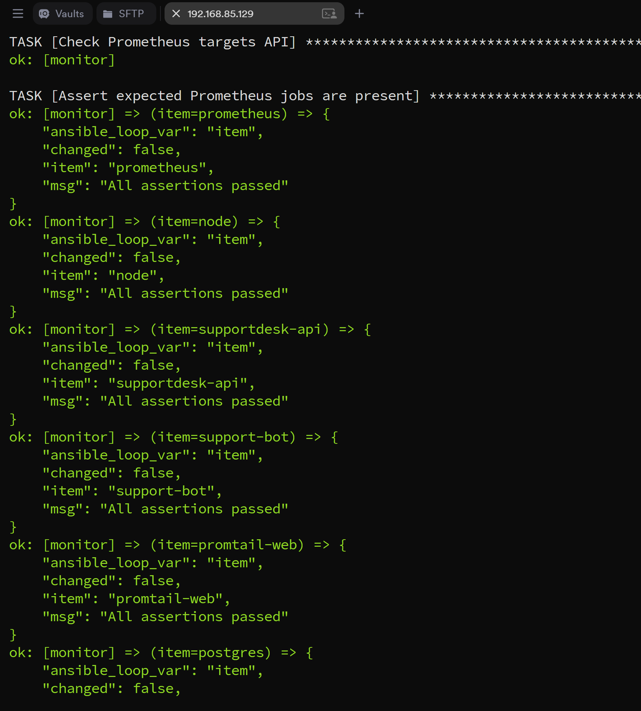
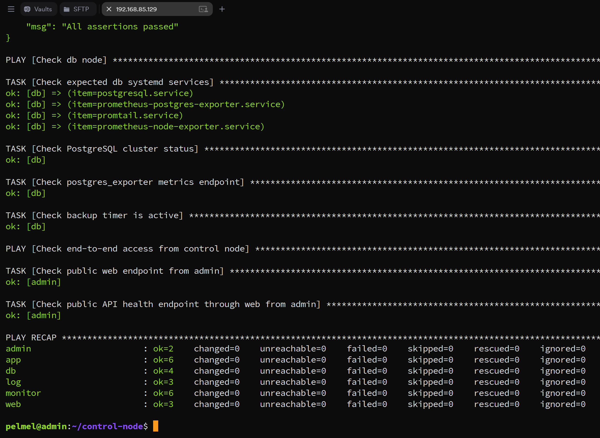
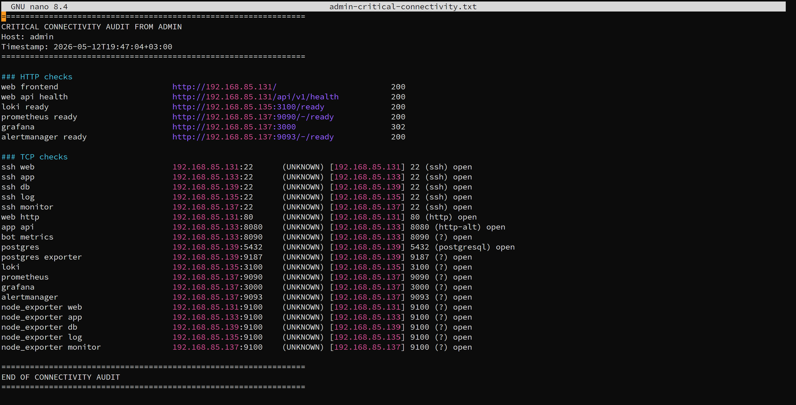

# Автоматизация

## Control node

`admin` используется как Ansible control node. На нем хранится inventory, group_vars, roles, playbook-и и файлы, которые раскатываются на managed nodes.

Актуальный Ansible-проект включен в пакет:

```text
infra/ansible/control-node/
```

## Структура

```text
ansible.cfg
inventory/
  hosts.ini
  group_vars/
playbooks/
roles/
files/
docs/network-audit/
```

## Роли

| Роль | Назначение |
|---|---|
| `common` | базовая подготовка managed nodes |
| `node_exporter` | установка и проверка node_exporter |
| `app_compose_project` | подготовка Docker Compose project на `app` |
| `docker_compose_service` | деплой одного compose service |
| `nginx_frontend` | деплой frontend и Nginx reverse proxy |
| `promtail` | деплой Promtail configs |
| `prometheus` | деплой Prometheus config и alert rules |
| `postgres_exporter` | установка и проверка postgres_exporter |
| `postgres_backup` | backup script, service/timer и manual backup check |

## Playbook-и

| Playbook | Назначение |
|---|---|
| `apply_baseline.yml` | базовая подготовка managed nodes |
| `check.yml` | общая проверка состояния стенда |
| `deploy_app.yml` | деплой backend API |
| `deploy_bot.yml` | деплой Telegram-клиента |
| `deploy_nginx_frontend.yml` | деплой Nginx/frontend |
| `deploy_promtail.yml` | деплой Promtail |
| `deploy_prometheus.yml` | деплой Prometheus config/rules |
| `deploy_postgres_exporter.yml` | деплой postgres_exporter |
| `deploy_postgres_backup.yml` | деплой backup automation |
| `run_db_backup.yml` | ручной запуск backup и проверка результата |
| `network_audit.yml` | аудит сетевого состояния |

## Проверка состояния

Основная команда проверки:

```bash
cd ~/control-node
ansible-playbook playbooks/check.yml
```



_Начало `check.yml`: web/app checks, Docker containers, API health и metrics endpoints._



_Продолжение `check.yml`: Loki, monitor services, Prometheus readiness, Alertmanager readiness, Grafana endpoint._



_Проверка Prometheus targets API и expected jobs: `prometheus`, `node`, `supportdesk-api`, `support-bot`, `promtail-web`, `postgres`._



_Итоговый recap: все узлы `ok`, `changed=0`, `failed=0`, `unreachable=0`._

## Network audit

Сетевые изменения не применяются основными ролями автоматически. Для сетевого слоя используется отдельный audit-playbook: он собирает состояние правил, портов и критических соединений, но не меняет firewall.

```bash
cd ~/control-node
ansible-playbook playbooks/network_audit.yml
```

Последний audit snapshot включен в пакет:

```text
infra/firewall/network-audit-latest/
```



_Audit-only отчет с проверкой критических HTTP/TCP потоков из `admin`._
