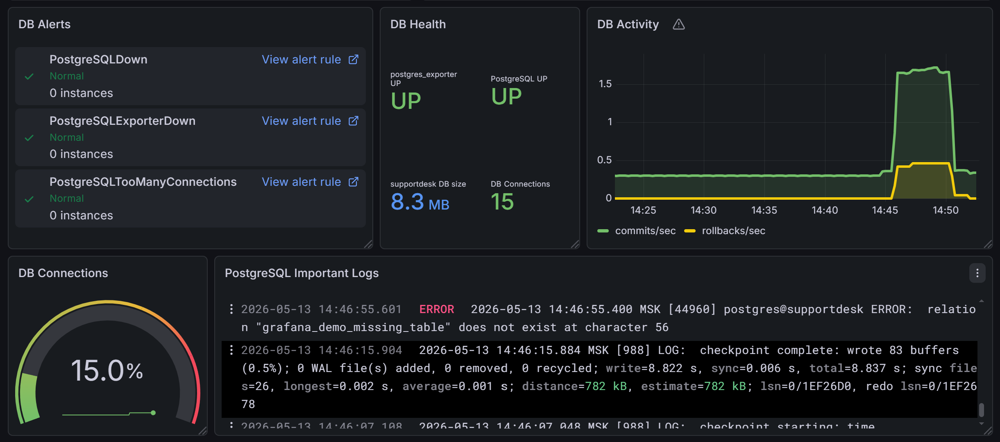
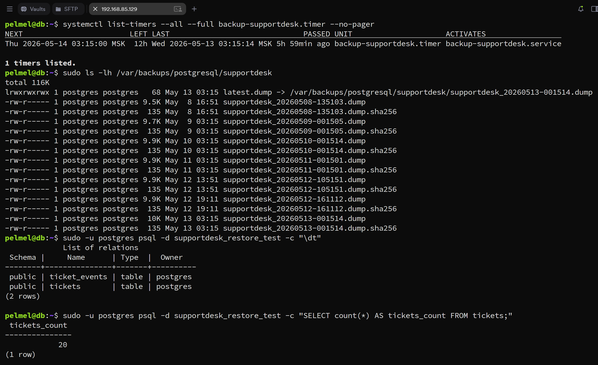

# PostgreSQL и резервное копирование

## Роль DB-узла

`db` хранит состояние приложения `MISIS_Digital Student Support`. Backend API подключается к PostgreSQL по TCP на `5432`.

| Параметр | Значение |
|---|---|
| Host | `192.168.85.139` |
| PostgreSQL | 17 |
| Database | `supportdesk` |
| Runtime role | `supportdesk_user` |
| Schema | `public` |

## Схема данных

Схема хранится в `infra/postgres/schema.sql`.

Основные таблицы:

| Таблица | Назначение |
|---|---|
| `tickets` | текущее состояние заявки |
| `ticket_events` | история событий и изменений |

`tickets` хранит `category`, `resource`, `priority`, `status`, timestamps и source. `ticket_events` фиксирует создание заявки, изменение статуса и служебные события.

## Доступ к БД

Доступ приложения ограничивается правилом `pg_hba.conf`:

```text
host    supportdesk    supportdesk_user    192.168.85.133/32    scram-sha-256
```

Пример находится в `infra/postgres/pg_hba.conf.example`.

## Наблюдаемость БД

Для PostgreSQL используются:

- `postgres_exporter` на `db:9187`;
- Prometheus job `postgres`;
- Grafana DB panels;
- PostgreSQL logs через Promtail в Loki;
- alerts `PostgreSQLExporterDown`, `PostgreSQLDown`, `PostgreSQLTooManyConnections`.



_DB panels в штатном состоянии: alerts normal, postgres_exporter/PostgreSQL UP, DB size, connections, activity и PostgreSQL logs._

## Backup design

Backup реализован через logical dump:

```text
pg_dump -Fc
sha256 checksum
latest.dump symlink
retention 7 days
systemd service/timer
restore test
```

Файлы:

```text
infra/postgres/backup_supportdesk.sh
infra/postgres/backup-supportdesk.service
infra/postgres/backup-supportdesk.timer
```

## Restore test

Restore test выполняется в отдельную тестовую БД. Это проверяет не только наличие dump-файла, но и возможность восстановить структуру и данные.



_Backup timer, список dump/checksum-файлов, `latest.dump`, таблицы restore-test БД и count записей._

## Снимки VM

Снимки виртуальных машин можно использовать как rollback-точки перед изменениями инфраструктуры. Резервное копирование данных приложения выполняется отдельно через PostgreSQL backup.
