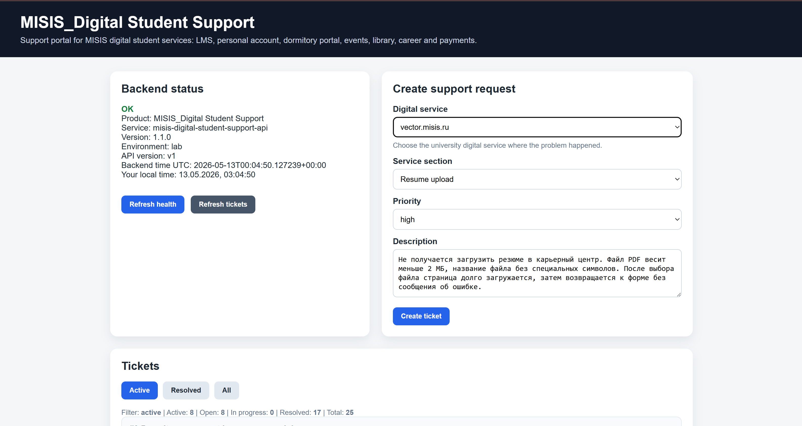
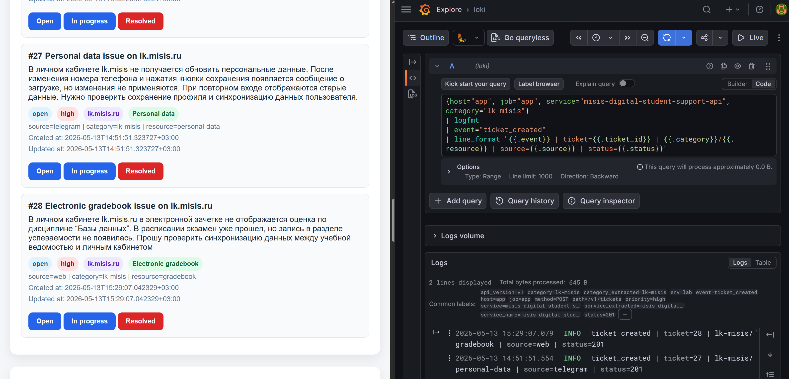
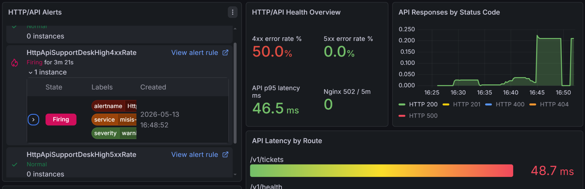

# Demo guide

Этот документ описывает содержательные сценарии демонстрации инфраструктурного стенда. Сценарии лучше показывать не как набор отдельных команд, а как цепочку наблюдений: пользовательское действие, состояние сервиса, запись в БД, лог, метрика, alert и восстановление.

Перед началом демонстрации желательно выполнить базовую проверку с `admin`:

```bash
cd ~/control-node
ansible-playbook playbooks/check.yml
```

Ожидаемый результат: все ключевые проверки проходят без `failed`.


_Финальный recap `check.yml`: все узлы проверены, `failed=0`, `unreachable=0`._

## Demo 1. End-to-end заявка: UI, API, PostgreSQL, logs, metrics

Цель: показать, что пользовательское действие проходит через все основные слои стенда.

Поток:

```text
Browser -> web/Nginx -> supportdesk-api -> db/PostgreSQL
```

Шаги:

1. Открыть frontend:

```text
http://192.168.85.131
```

2. Создать заявку с понятным разрезом, например:

```text
category=lk-misis
resource=gradebook
priority=high
description=В электронной зачетке не отображается оценка
source=web
```

3. Проверить backend через reverse proxy:

```bash
curl -s http://192.168.85.131/api/v1/health | python3 -m json.tool
```

4. Проверить запись в PostgreSQL на `db`:

```bash
sudo -u postgres psql -d supportdesk -P pager=off -c "SELECT id, category, resource, priority, status, source, created_at FROM tickets ORDER BY id DESC LIMIT 5;"
```

5. Проверить audit trail:

```bash
sudo -u postgres psql -d supportdesk -P pager=off -c "SELECT ticket_id, event, old_status, new_status, source, created_at FROM ticket_events ORDER BY id DESC LIMIT 10;"
```

6. Найти app log в Grafana/Loki:

```logql
{host="app", job="app", service="misis-digital-student-support-api", category="lk-misis"}
| logfmt
| event=~"ticket_created|ticket_status_changed"
```

7. Проверить product metrics в Prometheus:

```promql
sum by(status, category, resource, priority) (
  supportdesk_tickets_current{job="supportdesk-api", category="lk-misis", resource="gradebook"}
)
```

Ожидаемый итог:

```text
заявка появилась в UI;
строка появилась в tickets;
событие появилось в ticket_events;
app log содержит ticket_created;
product metric изменилась в Prometheus/Grafana.
```



_Заполненная форма создания заявки через web UI._


_Созданная заявка и соответствующий structured app log в Grafana/Loki._


_App logs после POST: видны validation/creation events, route, status и category/resource._

## Demo 2. Web и Telegram как два клиента одного backend API

Цель: показать, что web-интерфейс и Telegram-клиент используют общую backend-логику, а `support-bot` не пишет в PostgreSQL напрямую.

Потоки:

```text
Browser -> web/Nginx -> supportdesk-api -> db/PostgreSQL
Telegram user -> support-bot -> supportdesk-api -> db/PostgreSQL
```

Шаги:

1. Создать одну заявку через web UI.
2. Создать вторую заявку через Telegram bot.
3. Проверить последние заявки в PostgreSQL:

```bash
sudo -u postgres psql -d supportdesk -P pager=off -c "SELECT id, category, resource, priority, status, source FROM tickets ORDER BY id DESC LIMIT 10;"
```

4. Проверить события:

```bash
sudo -u postgres psql -d supportdesk -P pager=off -c "SELECT ticket_id, event, source, metadata_json, created_at FROM ticket_events ORDER BY id DESC LIMIT 10;"
```

5. Проверить backend app logs:

```logql
{host="app", job="app", service="misis-digital-student-support-api"}
| logfmt
| event="ticket_created"
```

6. Проверить bot logs:

```logql
{host="app", job="support-bot", service="misis-digital-support-bot"}
| logfmt
| event=~"ticket_created_via_bot|button_pressed|backend_health_ok"
```

7. Проверить bot metrics:

```promql
sum by(action) (increase(support_bot_actions_total{job="support-bot"}[10m]))
```

Ожидаемый итог:

```text
tickets.source различает web и telegram;
ticket_events.source фиксирует канал действия;
backend logs показывают единый API-path;
bot logs показывают действия Telegram-клиента;
прямого bot -> PostgreSQL слоя в архитектуре нет.
```



_Заявки с разным `source`: web и telegram, плюс фильтрация app logs в Loki._


_Bot observability: actions, API calls, bot logs и latency по backend endpoints._

## Demo 3. Product incident: концентрация заявок на одном ресурсе

Цель: показать не просто техническую доступность API, а прикладной сигнал — всплеск заявок по конкретному цифровому сервису и разделу.

Шаги:

1. Создать несколько active-заявок на одну пару `category/resource`, например:

```text
category=newlms-misis
resource=schedule
priority=normal/high
```

2. Проверить product metric:

```promql
sum by(category, resource) (
  supportdesk_tickets_current{job="supportdesk-api",status=~"open|in_progress"}
)
```

3. Проверить alert:

```text
SupportDeskTooManyTicketsForResource
```

4. Открыть Grafana panel `Active tickets by category/resource`.
5. Перевести часть заявок в `resolved`.
6. Повторить PromQL-запрос и убедиться, что active count уменьшился.

Ожидаемый итог:

```text
инцидент виден не как абстрактное “много заявок”, а как конкретная пара category/resource;
alert помогает локализовать проблемный цифровой сервис;
после закрытия заявок сигнал уменьшается.
```


_Product dashboard с active tickets by category/resource и oldest active ticket age._


_Alert `SupportDeskTooManyTicketsForResource` в состоянии FIRING по конкретной паре `lk-misis/gradebook`._

## Demo 4. Reverse proxy failure vs backend scrape failure

Цель: показать неоднозначный инцидент, где важно различать пользовательский путь и состояние Prometheus target-а.

Поток пользователя:

```text
Browser -> web/Nginx -> app:8080
```

Шаги:

1. На `app` остановить backend-контейнер:

```bash
cd /opt/app
sudo docker compose stop supportdesk-api
```

2. Через `web` сгенерировать пользовательские запросы:

```bash
for i in {1..5}; do
  curl -s -o /dev/null -w "%{http_code}
" http://192.168.85.131/api/v1/health
done
```

3. Проверить Prometheus targets:

```text
supportdesk-api -> DOWN
```

4. Проверить alerts:

```text
SupportDeskApiDown
Nginx502Spike
```

5. Проверить nginx logs:

```logql
{host="web", job="nginx"} |= " 502 "
```

6. Восстановить backend:

```bash
cd /opt/app
sudo docker compose start supportdesk-api
curl -s http://localhost:8080/v1/health | python3 -m json.tool
```

Ожидаемый итог:

```text
SupportDeskApiDown показывает, что Prometheus не может scrape-ить backend API;
Nginx502Spike показывает, что пользовательский reverse proxy path тоже сломан;
nginx logs подтверждают именно 502 на web-слое;
после восстановления backend-а target возвращается в UP, а 502 уходит из окна наблюдения.
```


_Dashboard/Prometheus view при controlled backend/proxy degradation._


_Prometheus Alerts: одновременно видны proxy/API сигналы по controlled failure._

## Demo 5. DB degradation: backend запущен, но stateful операции ломаются

Цель: показать более тонкий сценарий: контейнер backend API может быть доступен, но работа продукта нарушена из-за PostgreSQL.

Шаги:

1. На `db` остановить PostgreSQL cluster:

```bash
sudo pg_ctlcluster 17 main stop
pg_lsclusters
```

2. Проверить backend health и операции с заявками через `web`:

```bash
curl -i http://192.168.85.131/api/v1/health
curl -i http://192.168.85.131/api/v1/tickets
```

3. Проверить DB metrics:

```promql
pg_up{job="postgres",host="db"}
```

4. Проверить alerts:

```text
PostgreSQLDown
```

5. Проверить app logs на ошибки DB-операций:

```logql
{host="app", job="app", service="misis-digital-student-support-api"}
| logfmt
| error != ""
```

6. Восстановить PostgreSQL:

```bash
sudo pg_ctlcluster 17 main start
pg_lsclusters
```

7. Повторить пользовательскую операцию.

Ожидаемый итог:

```text
проблема отличается от падения backend-контейнера;
API runtime может оставаться запущенным, но операции чтения/записи заявок нарушаются;
DB alert и pg_up помогают локализовать слой отказа;
после восстановления PostgreSQL операции снова проходят.
```


_DB dashboard при остановленном PostgreSQL: PostgreSQL UP = DOWN, `PostgreSQLDown` FIRING._


_Prometheus/Grafana/Telegram: DB degradation приводит к backend/bot errors и пользовательскому сообщению об ошибке._


_Bot error logs и bot API responses при недоступной БД через backend API._

## Demo 6. Observability degradation: сервис работает, но сигнал пропал

Цель: показать, что monitoring/logging сами являются отдельными компонентами, и их деградация не всегда равна падению приложения.

Вариант A — пропали app logs:

```bash
# app
sudo systemctl stop promtail.service
```

Проверить:

```bash
curl -s http://192.168.85.131/api/v1/health
```

```logql
{host="app", job="app", service="misis-digital-student-support-api"}
```

Ожидаемый смысл:

```text
API продолжает отвечать;
новые app logs перестают поступать в Loki;
проблема находится не в приложении, а в log shipping.
```

Восстановление:

```bash
sudo systemctl start promtail.service
```

Вариант B — Prometheus target DOWN при живом сервисе:

```bash
# например, на web/app/db/log
sudo systemctl stop prometheus-node-exporter.service
```

Проверить:

```text
Prometheus /targets -> node target DOWN
NodeTargetDown -> PENDING/FIRING
```

Ожидаемый смысл:

```text
пользовательский сервис может быть доступен;
системные метрики конкретного узла не собираются;
alert относится к observability/agent layer.
```


_Observability degradation: node_exporter target DOWN при отдельном контролируемом сбое agent/metrics layer._

## Demo 7. HTTP/API quality: error rate и latency

Цель: показать, что стенд отслеживает не только факт доступности API, но и качество HTTP/API-слоя.

Шаги:

1. Сгенерировать нормальный и ошибочный трафик:

```bash
for i in {1..30}; do
  curl -s -o /dev/null http://192.168.85.131/api/v1/health
  curl -s -o /dev/null http://192.168.85.131/api/v1/tickets
  curl -s -o /dev/null http://192.168.85.131/api/bad-endpoint
done
```

2. Проверить request rate:

```promql
sum by(method, route) (
  rate(supportdesk_http_requests_total{job="supportdesk-api"}[5m])
)
```

3. Проверить status codes:

```promql
sum by(status_code) (
  rate(supportdesk_http_requests_total{job="supportdesk-api"}[5m])
)
```

4. Проверить p95 latency:

```promql
histogram_quantile(
  0.95,
  sum by(le) (
    rate(supportdesk_http_request_duration_seconds_bucket{job="supportdesk-api"}[5m])
  )
)
```

Ожидаемый итог:

```text
ошибочный route попадает в route="unmatched";
4xx видны отдельно от 5xx;
latency считается через histogram;
при достаточном объеме ошибочного трафика может сработать SupportDeskHigh4xxRate.
```


_HTTP/API panels: request rate, status codes и p95 latency по routes._



_Controlled 4xx traffic: `SupportDeskHigh4xxRate` в FIRING и 4xx error rate на dashboard._

## Demo 8. Backup/restore drill

Цель: показать, что backup — это не просто наличие файла, а проверяемый процесс восстановления.

Шаги на `admin`:

```bash
cd ~/control-node
ansible-playbook playbooks/run_db_backup.yml
```

Проверить на `db`:

```bash
sudo ls -lah /var/backups/postgresql/supportdesk
sudo readlink -f /var/backups/postgresql/supportdesk/latest.dump
sudo sha256sum -c /var/backups/postgresql/supportdesk/*.sha256
```

Проверить restore test, если он выполняется отдельным шагом:

```bash
sudo -u postgres createdb supportdesk_restore_test
sudo -u postgres pg_restore -d supportdesk_restore_test /var/backups/postgresql/supportdesk/latest.dump
sudo -u postgres psql -d supportdesk_restore_test -c "SELECT count(*) FROM tickets;"
sudo -u postgres dropdb supportdesk_restore_test
```

Ожидаемый итог:

```text
создан новый .dump;
создан .sha256;
latest.dump указывает на последний backup;
restore test подтверждает, что dump пригоден для восстановления.
```


_Каталог backup, `.sha256`, `latest.dump`, restore test и count по восстановленной таблице._

## Demo 9. Ansible operational control и network audit

Цель: показать, что стенд проверяется и частично управляется с единого control node.

Шаги:

```bash
cd ~/control-node
ansible-inventory --graph
ansible-playbook playbooks/check.yml
ansible-playbook playbooks/network_audit.yml
```

Проверить отчеты network audit:

```bash
find docs/network-audit/latest -maxdepth 2 -type f | sort
```

Ожидаемый итог:

```text
inventory отражает все узлы;
check.yml проверяет runtime, exporters, Promtail, PostgreSQL, backup timer и endpoints;
network_audit.yml собирает состояние firewall/Docker/network flows, но не меняет правила;
сетевой слой остается под ручным контролем и проверяется через отчет.
```


_Начало `check.yml`: web/app checks._


_Продолжение `check.yml`: log/monitor checks._


_Проверка expected Prometheus jobs через API._


_Итоговый recap `failed=0`._


_Отчет critical connectivity audit с HTTP/TCP checks._

## Рекомендуемый порядок показа

Для короткой демонстрации достаточно сценариев 1, 2, 4, 8 и 9.

Для глубокой демонстрации лучше показать:

```text
1. End-to-end заявка.
2. Web + Telegram как два клиента одного API.
3. Product incident по category/resource.
4. Reverse proxy/API failure.
5. DB degradation.
6. Observability degradation.
7. Backup/restore drill.
8. Ansible check + network audit.
```
