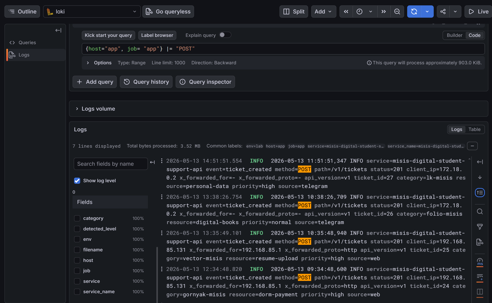
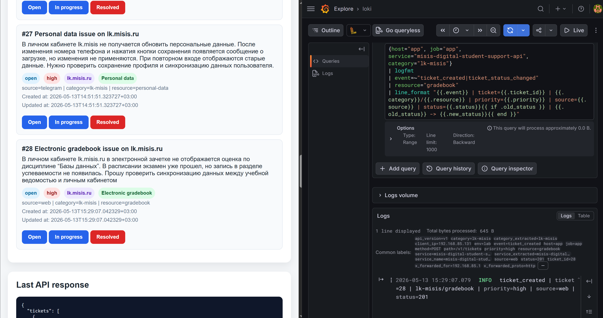
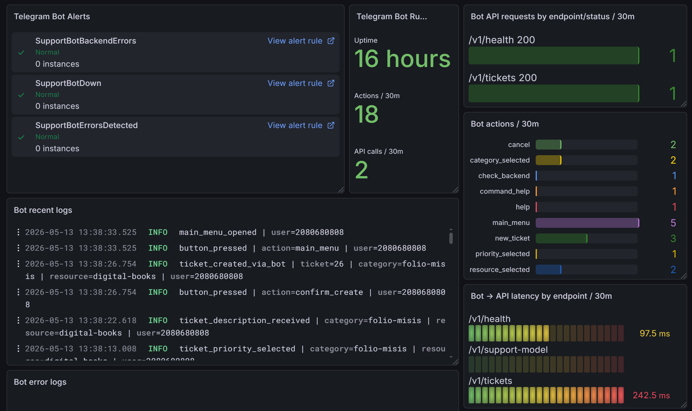
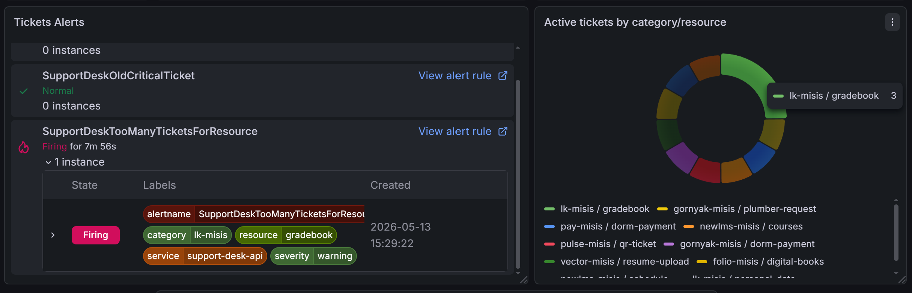
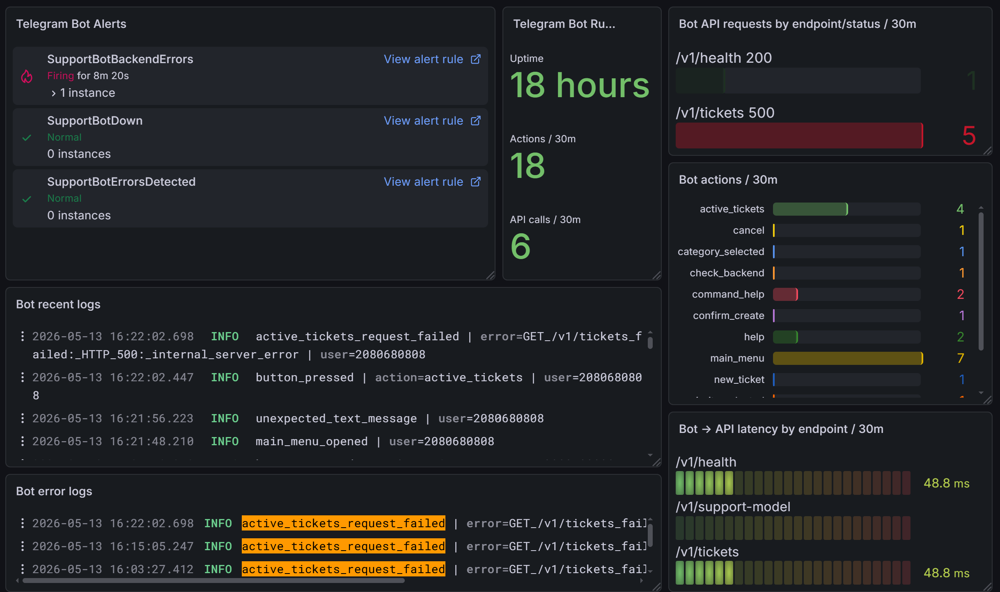

# Наблюдаемость

## Общая схема


_Логи идут через Promtail в Loki/Grafana, метрики — через exporters/API endpoints в Prometheus/Grafana/Alertmanager._

Наблюдаемость стенда состоит из трех уровней:

1. логи: Promtail -> Loki -> Grafana;
2. метрики: exporters/API metrics -> Prometheus -> Grafana;
3. алерты: Prometheus rules -> Alertmanager.

## Логирование

| Источник | Loki stream |
|---|---|
| nginx logs | `{host="web", job="nginx"}` |
| app logs | `{host="app", job="app", service="misis-digital-student-support-api"}` |
| bot logs | `{host="app", job="support-bot", service="misis-digital-support-bot"}` |
| PostgreSQL logs | `{host="db", job="postgresql"}` |

App logs пишутся в формате `key=value`. Promtail на `app` извлекает `category` как label, поэтому можно быстро фильтровать события по цифровому сервису.



_App logs в Grafana/Loki: видны `ticket_validation_failed`, HTTP method, path, status, category/resource и proxy metadata._



_Связка UI-заявки и Loki-запроса по той же category/resource: ticket id и structured log совпадают._

## Метрики

Prometheus собирает:

- системные метрики через node_exporter;
- product metrics и HTTP/API metrics с backend API;
- bot metrics с Telegram-клиента;
- PostgreSQL metrics через postgres_exporter;
- nginx-derived HTTP status metrics из Promtail на `web`.

Ключевые jobs:

```text
node
supportdesk-api
support-bot
promtail-web
postgres
```


_Prometheus targets: `node (5/5 up)`, `postgres (1/1 up)`, `prometheus (1/1 up)`._


_Prometheus targets: `promtail-web`, `support-bot`, `supportdesk-api` в состоянии UP._

## Dashboard

Экспортированный dashboard находится в:

```text
infra/grafana/infrastructure-overview-dashboard.json
```

Dashboard `Infrastructure Overview` содержит блоки:

- состояние узлов;
- CPU/RAM/Disk;
- app logs и nginx logs;
- ticket metrics;
- HTTP/API observability;
- DB observability;
- Telegram Bot observability;
- alert list panels.


_Общий вид dashboard: Targets UP, tickets, app/nginx logs, CPU/RAM/Disk._


_Product observability: tickets alerts, active tickets by category/resource и oldest active ticket age._


_HTTP/API observability: error rate, p95 latency, response status codes и latency by route._


_DB observability: DB alerts, DB Health, connections, activity и PostgreSQL logs._



_Telegram Bot observability: bot alerts, runtime, API requests/actions, bot logs и bot → API latency._

## Alerts

Alert rules находятся в `infra/prometheus/supportdesk.rules.yml`.

Группы alerts:

| Группа | Примеры |
|---|---|
| Application | `SupportDeskApiDown` |
| HTTP/API | `HttpApiSupportDeskHigh4xxRate`, `HttpApiSupportDeskHigh5xxRate`, `HttpApiNginx502Spike` |
| Product | `SupportDeskTooManyTicketsForResource`, `SupportDeskCriticalTicketsOpen` |
| Database | `PostgreSQLDown`, `PostgreSQLTooManyConnections` |
| Bot | `SupportBotDown`, `SupportBotBackendErrors` |
| Infrastructure | `HighDiskUsage`, `NodeTargetDown` |



_Controlled product alert `SupportDeskTooManyTicketsForResource` по конкретной паре category/resource._


_Controlled backend/proxy failure: Prometheus Alerts показывает активные сигналы._



_DB degradation: `PostgreSQLDown`, bot/backend errors и пользовательское сообщение об ошибке._

## Примеры запросов

PromQL-примеры находятся в `examples/promql.md`.

LogQL-примеры находятся в `examples/logql.md`.
