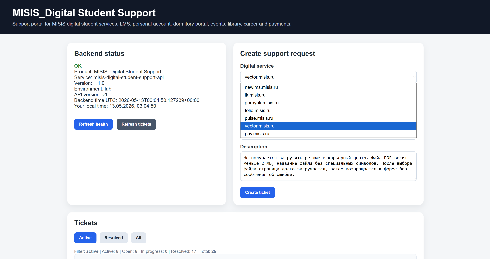
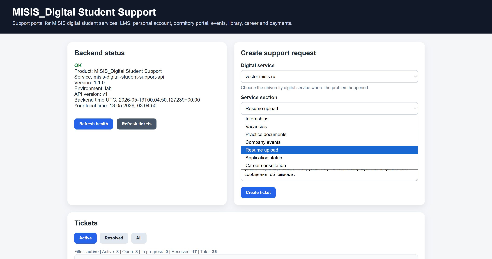
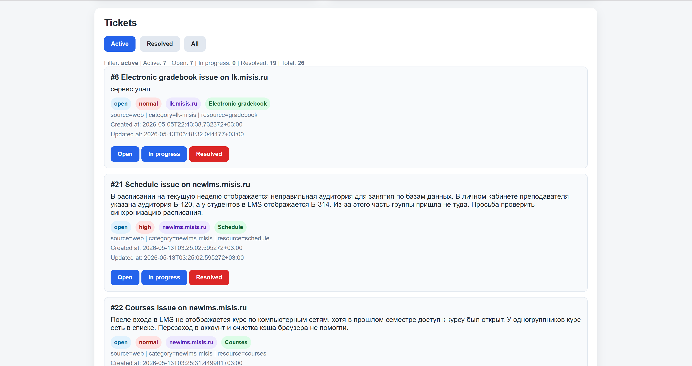

# Runtime и развертывание

## Рабочая нагрузка

`MISIS_Digital Student Support` используется как рабочая нагрузка инфраструктурного стенда. Приложение генерирует HTTP-запросы, app logs, product metrics, записи в PostgreSQL и события для демонстрации диагностики.


## Пользовательский UI runtime

Frontend на `web` показывает backend health, форму создания заявки, динамический выбор цифрового сервиса и раздела, а также active/resolved/all списки заявок.



_Выбор цифрового сервиса в frontend._



_Выбор раздела сервиса после выбора category._



_Список active-заявок с status/source/category/resource._

## Backend API

Backend API работает на узле `app` как Docker Compose service `supportdesk-api`.

| Параметр | Значение |
|---|---|
| Container | `misis-digital-student-support-api` |
| Image | `misis-digital-student-support-api:local` |
| Host port | `8080` |
| Healthcheck | `GET /v1/health` |
| Metrics | `GET /metrics` |
| Storage | PostgreSQL `supportdesk` на `db:5432` |
| Logs | `/var/log/app/app.log` |

Основные runtime-файлы:

```text
infra/docker/Dockerfile
infra/docker/docker-compose.yml
src/app.py
examples/env/app.env.example
```

## Telegram-клиент

Telegram-клиент работает на узле `app` как отдельный Docker Compose service `support-bot`. Он не пишет в PostgreSQL напрямую, а обращается к backend API.

| Параметр | Значение |
|---|---|
| Container | `misis-digital-support-bot` |
| Image | `misis-digital-support-bot:local` |
| Metrics port | `8090` |
| Backend dependency | `http://supportdesk-api:8080` внутри Docker Compose network |
| Logs | `/var/log/bot/support-bot.log` |

Основные файлы:

```text
infra/docker/Dockerfile.bot
infra/docker/docker-compose.yml
src/bot.py
examples/env/bot.env.example
```


_Web UI и Telegram bot обращаются к одному backend API; состояние хранится в PostgreSQL._

## Docker Compose

Compose-файл находится в `infra/docker/docker-compose.yml` и описывает два сервиса:

- `supportdesk-api`;
- `support-bot`.

Оба сервиса собираются локально, запускаются с `restart: unless-stopped` и пишут логи в host-mounted каталоги, откуда их читает Promtail.

## Развертывание через Ansible

Актуальная структура Ansible-проекта находится в `infra/ansible/control-node/`.

Ключевые playbook-и:

| Playbook | Назначение |
|---|---|
| `deploy_app.yml` | деплой backend API |
| `deploy_bot.yml` | деплой Telegram-клиента |
| `check_app_compose_project.yml` | проверка Docker Compose project на `app` |
| `check.yml` | общая проверка состояния стенда |

## Проверка после развертывания

Минимальная проверка runtime-слоя:

```bash
cd /opt/app
sudo docker compose ps
curl -s http://localhost:8080/v1/health
curl -s http://localhost:8080/metrics | head
curl -s http://localhost:8090/metrics | head
```

Проверка через Ansible:

```bash
cd ~/control-node
ansible-playbook playbooks/check.yml
```
