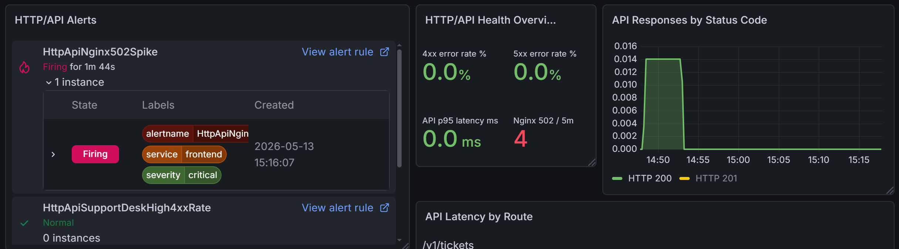
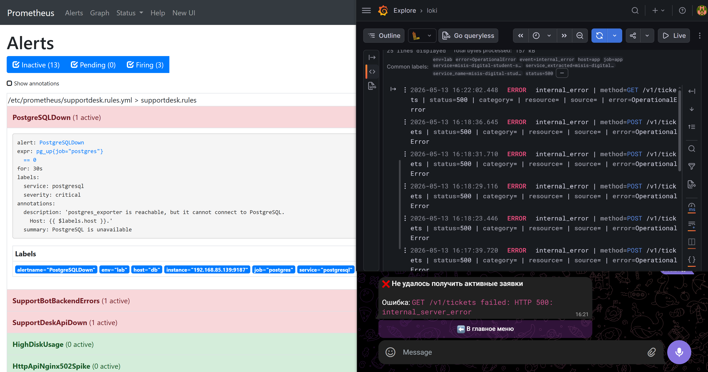
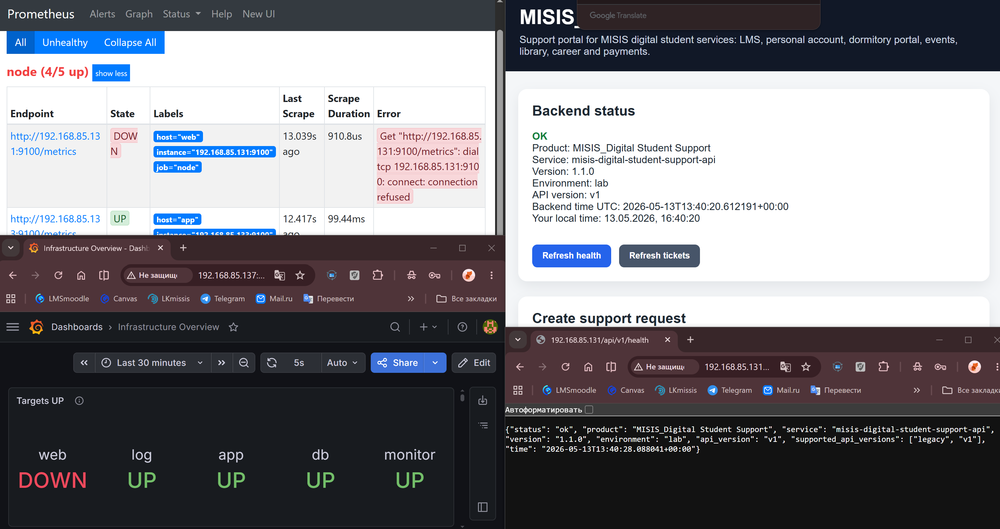
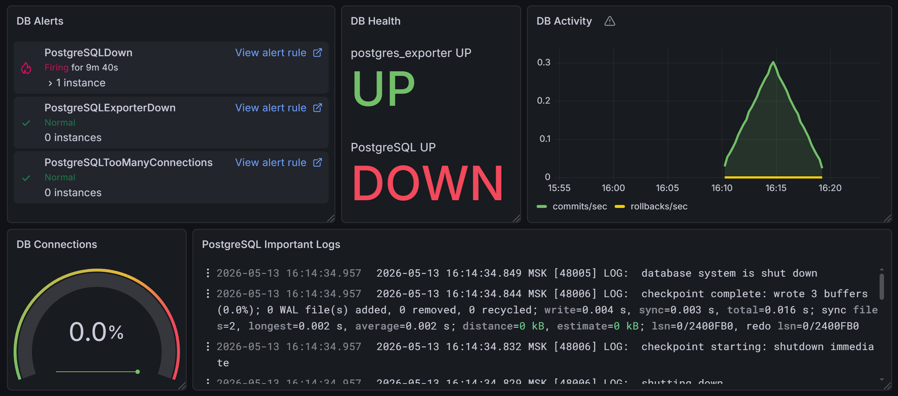

# Troubleshooting

Этот документ помогает разбирать неоднозначные проблемы стенда. Логика диагностики такая: сначала определить слой сбоя, затем проверить ближайший контракт между компонентами, потом смотреть logs/metrics/alerts.

Полные таблицы портов и access matrix находятся в `docs/network-and-security.md`. Здесь приведены практические разборы по симптомам.

## Быстрая карта диагностики

| Симптом | Первый слой проверки | Что смотреть дальше |
|---|---|---|
| UI открыт, но backend status не OK | `web -> app` | Nginx 502, `supportdesk-api` container, firewall/DOCKER-USER |
| `/api/v1/health` через web дает 502 | reverse proxy path | Nginx config, app:8080, backend container |
| `supportdesk-api` target DOWN | backend scrape target | Docker Compose, port 8080, `/metrics`, Prometheus target labels |
| API отвечает, но заявки не создаются | PostgreSQL | `pg_lsclusters`, `pg_up`, DB credentials, `pg_hba.conf`, app logs |
| Telegram bot отвечает ошибкой, web работает | bot/API dependency | `support-bot` container, `SUPPORTDESK_API_URL`, bot logs, bot metrics |
| Логи не появляются в Grafana/Loki | log shipping | Promtail на source node, Loki `/ready`, labels, file paths |
| Сервис работает, но target DOWN | exporter/metrics layer | node_exporter/postgres_exporter/promtail metrics endpoint, firewall |
| Alert не появляется | Prometheus rules path | `promtool`, expression, labels, `for`, достаточный объем событий |
| Backup не появился | backup automation | timer, service, journal, permissions, disk space |
| Ansible check упал | control plane | SSH, sudo/become, inventory/group_vars, конкретный failed task |

## 1. UI открыт, но backend status не OK

### Смысл проблемы

Frontend может отдаваться с `web`, но API-путь может быть сломан отдельно:

```text
Browser -> web/Nginx -> app:8080
```

Это не всегда означает, что весь стенд упал. Нужно различить:

```text
Nginx работает, backend недоступен;
backend работает, но не через reverse proxy;
backend работает, но операции ломаются на DB;
Prometheus target недоступен из-за metrics/firewall, а пользовательский путь живой.
```

### Проверки

На `web`:

```bash
sudo nginx -t
curl -i http://localhost/
curl -i http://localhost/api/v1/health
```

На `app`:

```bash
cd /opt/app
sudo docker compose ps
curl -i http://localhost:8080/v1/health
curl -i http://localhost:8080/metrics
```

В Grafana/Loki:

```logql
{host="web", job="nginx"} |= " /api/"
```

```logql
{host="app", job="app", service="misis-digital-student-support-api"}
| logfmt
| path="/v1/health"
```

### Интерпретация

| Результат | Вывод |
|---|---|
| `localhost:8080/v1/health` на `app` не отвечает | проблема в backend runtime |
| `app` отвечает, но `web/api/v1/health` дает 502 | проблема в reverse proxy path или сетевом доступе `web -> app` |
| health отвечает, но `/tickets` падает | вероятна проблема PostgreSQL/storage layer |
| web/API работает, но Prometheus target DOWN | проблема scrape path/metrics/firewall, не обязательно пользовательский downtime |

### Восстановление

```bash
# app
cd /opt/app
sudo docker compose start supportdesk-api
sudo docker compose ps
curl -s http://localhost:8080/v1/health | python3 -m json.tool
```

После восстановления проверить через `web`:

```bash
curl -s http://192.168.85.131/api/v1/health | python3 -m json.tool
```

## 2. Nginx возвращает 502



_Пример controlled failure: пользовательский путь через Nginx деградирует, а dashboard показывает проблему._


_Prometheus Alerts показывает разные сигналы по одному backend/proxy отказу._


### Симптомы

```text
frontend открывается;
/api/* возвращает 502;
в nginx access.log есть status_code=502;
может сработать Nginx502Spike.
```

### Проверки

На `web`:

```bash
sudo nginx -t
sudo tail -n 50 /var/log/nginx/error.log
curl -i http://localhost/api/v1/health
```

На `app`:

```bash
curl -i http://192.168.85.133:8080/v1/health
cd /opt/app && sudo docker compose ps
```

Проверить метрику nginx status codes:

```promql
increase(promtail_custom_nginx_http_responses_total{job="promtail-web",host="web",status_code="502"}[5m])
```

### Возможные причины

```text
supportdesk-api container stopped;
порт app:8080 недоступен с web;
Nginx proxy_pass указывает не туда;
Docker published port закрыт для web;
backend стартует, но падает сразу после запуска.
```

### Восстановление

```bash
# app
cd /opt/app
sudo docker compose up -d supportdesk-api
sudo docker compose logs --tail=100 supportdesk-api
```

```bash
# web
curl -i http://localhost/api/v1/health
```

## 3. Backend target DOWN, но пользовательский путь может быть разным

### Симптомы

```text
Prometheus /targets показывает supportdesk-api DOWN;
SupportDeskApiDown PENDING/FIRING;
не всегда сразу понятно, сломан ли пользовательский путь.
```

### Проверки

На `monitor`:

```bash
curl -s http://localhost:9090/-/ready
```

На `app`:

```bash
curl -i http://localhost:8080/metrics
curl -i http://localhost:8080/v1/health
```

С `monitor` до `app`:

```bash
curl -i http://192.168.85.133:8080/metrics
```

### Интерпретация

| Результат | Вывод |
|---|---|
| `/metrics` не отвечает даже локально на `app` | backend не слушает порт или контейнер упал |
| `/metrics` отвечает на `app`, но не с `monitor` | сетевой доступ/firewall/DOCKER-USER для scrape path |
| `/metrics` отвечает, но target DOWN | проверить `prometheus.yml`, labels, target address |
| `/v1/health` отвечает, а `/metrics` нет | проблема в metrics endpoint, не обязательно в API runtime |

## 4. PostgreSQL недоступен или stateful операции ломаются



_DB dashboard при `PostgreSQLDown`._


_Пользовательский и bot-эффект при недоступной PostgreSQL через backend API._


### Симптомы

```text
health может отвечать, но tickets endpoints падают;
создание заявки не проходит;
pg_up=0;
PostgreSQLDown или PostgreSQLExporterDown;
app logs содержат DB-related errors.
```

### Проверки на `db`

```bash
pg_lsclusters
sudo ss -tulpn | grep :5432
sudo systemctl status postgresql --no-pager
sudo systemctl status prometheus-postgres-exporter.service --no-pager
```

Проверка подключения с `app`:

```bash
PGPASSWORD='<redacted>' psql -h 192.168.85.139 -U supportdesk_user -d supportdesk -P pager=off -c "SELECT current_user, current_database(), inet_server_addr(), inet_client_addr();"
```

Проверка Prometheus:

```promql
pg_up{job="postgres",host="db"}
```

### Интерпретация

| Результат | Вывод |
|---|---|
| `pg_lsclusters` показывает `down` | PostgreSQL cluster остановлен |
| PostgreSQL online, но app не подключается | проверить `pg_hba.conf`, пароль, firewall, DB_HOST |
| `pg_up=0`, но PostgreSQL работает | проблема postgres_exporter или его DSN |
| API health OK, tickets fail | backend runtime живой, но storage layer поврежден/недоступен |

### Восстановление

```bash
sudo pg_ctlcluster 17 main start
pg_lsclusters
```

После восстановления:

```bash
curl -s http://192.168.85.131/api/v1/tickets | python3 -m json.tool
```

## 5. Telegram-клиент не создает заявки, но web работает

### Смысл проблемы

Telegram flow отличается от web-flow:

```text
Telegram user -> support-bot -> supportdesk-api -> PostgreSQL
```

Если web работает, а Telegram нет, чаще всего проблема находится в `support-bot` или в его обращении к backend API, а не в PostgreSQL напрямую.

### Проверки на `app`

```bash
cd /opt/app
sudo docker compose ps
sudo docker compose logs --tail=100 support-bot
curl -s http://localhost:8090/metrics | grep support_bot
curl -s http://localhost:8080/v1/health | python3 -m json.tool
```

Проверить, что `support-bot` внутри Compose использует backend service name:

```bash
cd /opt/app
sudo docker compose exec support-bot python - <<'PY'
import os
print(os.environ.get('SUPPORTDESK_API_URL'))
PY
```

Проверить bot logs в Loki:

```logql
{host="app", job="support-bot", service="misis-digital-support-bot"}
| logfmt
| event=~"backend_health_failed|ticket_create_failed|handler_error|support_model_load_failed"
```

Проверить bot backend errors:

```promql
sum by(endpoint, method, status_code) (
  increase(support_bot_api_requests_total{job="support-bot",status_code!~"2.."}[10m])
)
```

### Интерпретация

| Результат | Вывод |
|---|---|
| `support-bot` container не running | проблема runtime bot-сервиса |
| bot metrics не отвечают на `8090` | bot process или published metrics port |
| backend health локально OK, bot пишет backend error | проверить `SUPPORTDESK_API_URL` и Compose network |
| web и bot оба не создают заявки | вероятнее проблема backend API или PostgreSQL |

## 6. Логи не приходят в Loki

### Симптомы

```text
сервис работает;
новых строк в Grafana/Loki нет;
Prometheus/Grafana могут показывать нормальное состояние API.
```

### Проверки на source node

```bash
systemctl status promtail --no-pager
curl -s http://localhost:9080/metrics | head
sudo tail -n 20 /var/log/app/app.log      # app
sudo tail -n 20 /var/log/bot/support-bot.log  # app
sudo tail -n 20 /var/log/nginx/access.log # web
sudo tail -n 20 /var/log/postgresql/postgresql-17-main.log # db
```

Проверки на `log`:

```bash
curl -s http://localhost:3100/ready
systemctl status loki --no-pager
```

### Частые причины

```text
Promtail остановлен;
неверный __path__ в config.yml;
нет прав на чтение log-файла;
Loki недоступен на log:3100;
в Grafana выбран неправильный label set;
новых событий еще не было после рестарта Promtail.
```

### Восстановление

```bash
sudo systemctl restart promtail.service
journalctl -u promtail.service -n 100 --no-pager
```

Проверить точные labels в Grafana Explore через label browser или запросами:

```logql
{host="app"}
{host="web"}
{host="db"}
```

## 7. Метрики не собираются, но сервис работает

### Симптомы

```text
Prometheus target DOWN;
приложение/сервис может отвечать пользователю;
alert относится к exporter или scrape path.
```

### Проверки

Node exporter:

```bash
systemctl status prometheus-node-exporter.service --no-pager
ss -tulpn | grep :9100
curl -s http://localhost:9100/metrics | head
```

PostgreSQL exporter:

```bash
systemctl status prometheus-postgres-exporter.service --no-pager
curl -s http://localhost:9187/metrics | grep pg_up
```

Promtail custom metrics на `web`:

```bash
curl -s http://localhost:9080/metrics | grep promtail_custom_nginx_http_responses_total
```

Bot metrics на `app`:

```bash
curl -s http://localhost:8090/metrics | grep support_bot
```

### Интерпретация

```text
если локальный /metrics работает, но Prometheus target DOWN — искать сетевой доступ от monitor;
если локальный /metrics не работает — искать exporter/process/config;
если метрика есть, но alert/query пустой — проверить labels в Prometheus.
```

## 8. Alert не срабатывает или не гаснет

### Проверки на `monitor`

```bash
promtool check config /etc/prometheus/prometheus.yml
promtool check rules /etc/prometheus/supportdesk.rules.yml
curl -s http://localhost:9090/-/ready
```

Проверить выражение напрямую в Prometheus UI:

```text
Status -> Rules
Alerts
Expression browser
```

### Частые причины

```text
не набралось условие `for`;
слишком мало событий для условий с минимальным traffic threshold;
labels в query не совпадают с фактическими labels метрик;
alert уже не firing, но метрика еще видна в окне rate/increase;
для Nginx502Spike нужно сгенерировать несколько 502 через web path;
для SupportDeskHigh4xxRate нужен достаточный объем 4xx и общий traffic denominator.
```

### Примеры проверок

```promql
ALERTS{alertstate="firing"}
up{job="supportdesk-api"}
increase(promtail_custom_nginx_http_responses_total{status_code="502"}[5m])
```

## 9. Backup failed или restore test не проходит

### Проверки на `db`

```bash
systemctl status backup-supportdesk.timer --no-pager
systemctl status backup-supportdesk.service --no-pager
journalctl -u backup-supportdesk.service -n 100 --no-pager
sudo ls -lah /var/backups/postgresql/supportdesk
```

Проверить latest symlink и checksum:

```bash
sudo readlink -f /var/backups/postgresql/supportdesk/latest.dump
sudo sha256sum -c /var/backups/postgresql/supportdesk/*.sha256
```

Через Ansible:

```bash
cd ~/control-node
ansible-playbook playbooks/run_db_backup.yml
```

### Частые причины

```text
не хватает прав на backup directory;
PostgreSQL cluster down;
недостаточно места на диске;
сломался latest.dump symlink;
checksum не соответствует dump;
restore test запускается в БД, которая уже существует.
```

## 10. Ansible check failed

### Проверки на `admin`

```bash
cd ~/control-node
ansible-inventory --graph
ansible managed -m ping
ansible-playbook playbooks/check.yml -vv
```

### Интерпретация

| Где упало | Что проверить |
|---|---|
| SSH unreachable | IP, SSH service, ключи, firewall на target node |
| Become failed | sudo password / become settings |
| Service check failed | соответствующий systemd service или Docker Compose service |
| URI check failed | endpoint, порт, firewall, приложение |
| Prometheus expected jobs failed | `prometheus.yml`, target labels, service availability |
| Backup check failed | backup timer/service/path/checksum |

## 11. Docker published port доступен не так, как ожидается

### Смысл проблемы

Docker published ports могут обходить обычные ожидания от host firewall, поэтому для `app:8080` и `app:8090` используется отдельный контроль через `DOCKER-USER`.

### Проверки

```bash
sudo iptables -S DOCKER-USER
sudo iptables -L DOCKER-USER -n -v
sudo ufw status numbered
```

Проверить с разрешенных узлов:

```bash
# web -> app API
curl -i http://192.168.85.133:8080/v1/health

# monitor -> app metrics
curl -i http://192.168.85.133:8080/metrics
curl -i http://192.168.85.133:8090/metrics
```

### Интерпретация

```text
web должен иметь доступ к app:8080 для reverse proxy;
monitor должен иметь доступ к metrics endpoints;
лишние источники не должны иметь прямой доступ к published ports;
network_audit.yml должен фиксировать текущее состояние для проверки.
```

## 12. Когда смотреть demo-guide, а когда troubleshooting

`docs/demo-guide.md` используется, когда нужно показать стенд управляемо: заранее выбранный controlled failure, ожидаемые метрики и восстановление.

`docs/troubleshooting.md` используется, когда симптом уже возник и неизвестно, где причина: web, app, PostgreSQL, Promtail, Loki, Prometheus, firewall или Ansible control plane.


## 6a. Node exporter target DOWN



_Пример деградации observability agent: node target DOWN и alert по node_exporter, при этом пользовательский слой может оставаться доступным._


## Визуальный пример bot/backend errors



_Bot error logs и API responses при сбое backend/storage dependency._
